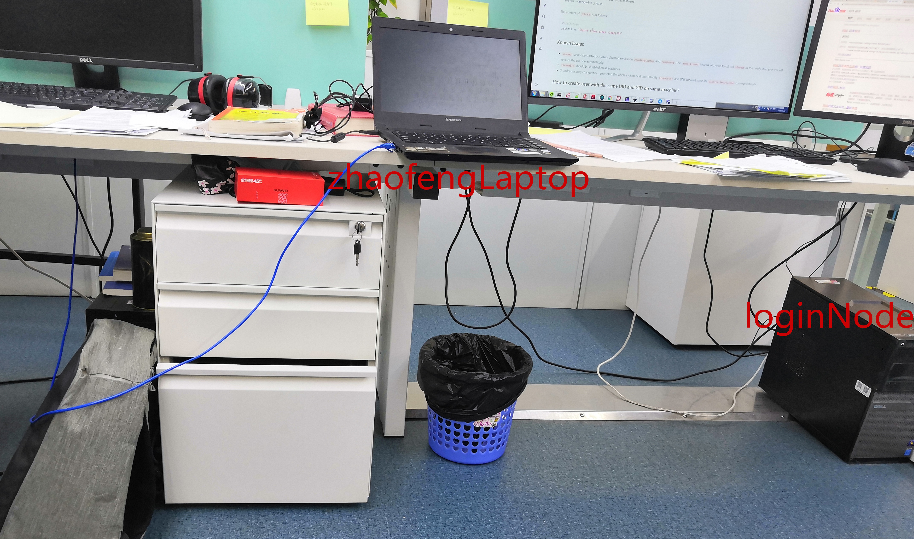
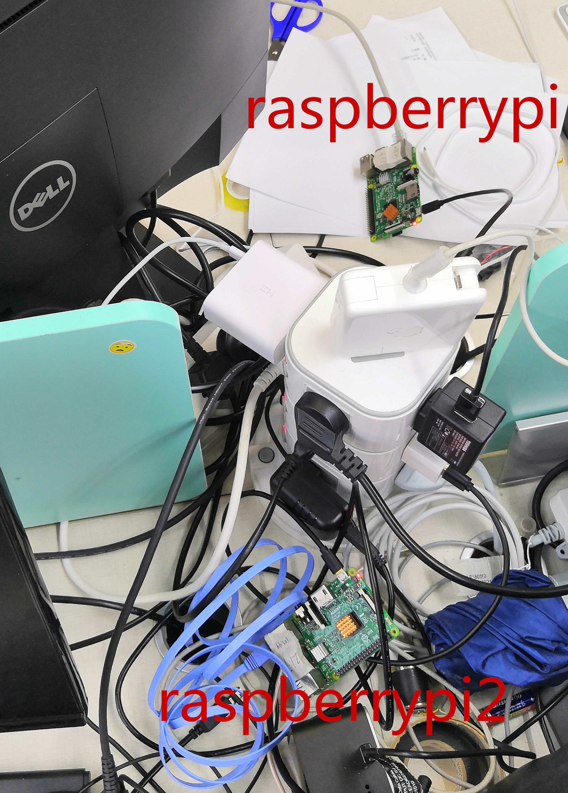

## Computer

| architecture | operating system | ip address  | hostname           | slurm version | slurm config file          |
|--------------|------------------|-------------|--------------------|---------------|----------------------------|
| x86_64       | CentOS 7.7       | 10.8.15.207 | zhiyuanWorkstation | 19.05         | /etc/slurm/slurm.conf      |
| x86_64       | Fedora 30        | 10.8.15.92  | zhaofengLapTop     | 19.05         | /etc/slurm/slurm.conf      |
| armhf        | Raspbian 8       | 10.8.15.88  | raspberrypi        | 18.08         | /etc/slurm-llnl/slurm.conf |
| armhf        | Raspbian 10      | 10.8.15.87  | raspberrypi2       | 18.08         | /etc/slurm-llnl/slurm.conf |

`zhiyuanWorkstation` is the manage node.

## Test User
The users exist on all computers list above.

| username  | passwd      | uid  | gid  |
|-----------|-------------|------|------|
| zhaofengt | fengzhao    | 1010 | 1010 |
| zhiyuant  | qinghua2019 | 1011 | 1011 |


`zhaofengt` is the user with sudo privilege on all nodes. You can login to the computers through `ssh` if you are on the 15th floor of C2, Nanshan Park.

[Installation Guide](https://www.slothparadise.com/how-to-install-slurm-on-centos-7-cluster/)


## Test Command
On manage node, use the following command to test that the whole system works.
```shell
srun -w zhaofengLapTop hostname
srun -w raspberrypi,raspberrypi2 /bin/hostname
sbatch --array=0-9 job.sh
```
The content of `job.sh` is as follows:
```shell
#!/bin/bash
python3 -c "import times;times.sleep(30)"
```

## Known Issues
* `slurmd` cannot be started as system daemon service on `zhaofengLapTop`. Use `sudo slurmd` instead. No need to kill old `slurmd` as the newly start process will replace the old one automatically.
* `firewalld` should be disabled on all machines.
* IP addresses may change when you setup the whole system next time. Modify `slurm.conf` and DNS forward zone file `cluster.local.zone` correspondingly.

## How to create user with the same UID and GID on same machine?
With the example user `zhaofengt` and UID = GID = 1010, the command is as follows:
```shell
sudo groupadd -g 1010 zhaofengt
sudo useradd -d /home/zhaofengt -g zhaofengt -u 1010 -s /bin/bash -m zhaofengt
sudo passwd zhaofengt
```

## Steps
Ideally, we should have a router, many wired lines and 4 computers. However, 
Resources are limited. We do not have control over the router and we do not have so many computers.
What we have is an environment of intranet, an old laptop with Fedora, a PC with CentOS and several Rasberry Pi 3B. Reinstalling the OS is time consuming and we omit this
step. As a result, we use heterogeneous architecture to build our cluster test environment.

1. Make sure all the nodes are physically connected in an intranet. To easy the configuration, the ssh server should be opened on all the nodes. The service name is called `sshd` on
    RHEL and `ssh` on Raspbian.  The package name is called `openssh-server` on all distributions. Create users `zhaofengt` and `zhiyuant` on all nodes. Make sure the users have the same UID and GID on different nodes.
1. `munge` should be installed on all nodes. See [Install Guide](https://github.com/dun/munge/wiki/Installation-Guide) for detail. The `munge.key` should be the same on all machines.
    This package can be installed using `apt` or `yum`.
1. Install `slurmctld` on manage node and `slurmd` on compute node. The version of `slurmctld` and `slurmd` may not be exactly the same, as announced by [slurm official](https://slurm.schedmd.com/troubleshoot.html#network).
   Since Debian 10 has officially packaged 18.8, we just install `slurmd` on Debian 10 using `apt` without compiling from source code. However, for Debian 8 the version is only 14. Therefore
   we should compile 19.5 from source code. Actually we do the compilation on the board (instead virtual machine) and notice that it is slow process.
1. The configuration file is generated using [configurator.easy](https://slurm.schedmd.com/configurator.easy.html). For our configuration, we use `root` to start
   `slurmctld`. That is, `SlurmUser=root`. We use `Cgroup` to track the process; therefore `cgroup.conf` should exist in the same directory of `slurm.conf`on all nodes.   
1. Other utilities can help administrators to manage the cluster. For example, we use ssh key to make `ssh raspberrypi` without password prompt; We setup a DNS server, the 
   setup file of forward zone can be found at this repository (`cluster.local.zone`), which should be put in directory `/var/named/`. The service is called `named`, coming from `bind` package for RHEL. 
   The setup file is located at `/etc/named.conf`. Add the following entry to this file:
   ```
   zone "cluster.local" IN {
        type master;
        file "cluster.local.zone";
    };
   ```
   The DNS server is used
   to map the hostname to its ip address. To achieve this, we need add the DNS server entry in `/etc/resolv.conf`. 
   ```
   search cluster.local
   nameserver 127.0.0.1
   ```
   We also use the `pdsh` utility (with gender database) to execute
   commands on multiple nodes. The test command is `pdsh -A python3 --version`. With this command, the output is as follows:
   ```
    [zhaofengt@zhiyuanWorkstation ~]$ pdsh -A python3 --version
    raspberrypi: Python 3.4.2
    zhaofengLaptop: Python 3.7.3
    raspberrypi2: Python 3.7.3
   ```
   Since the official package of `pdsh` on CentOS 7 does not support `gender` backend. We need to compile `pdsh` from source code and add `export PDSH_RCMD_TYPE=ssh` in our admin `.bashrc`.
   
Available binary for CentOS 7, see [copr](https://copr.fedorainfracloud.org/coprs/cmdntrf/Slurm19-nvml/package/slurm/)


## job Queue
zhaofeng's laptop only has two physical cpus. The number of logical cpus is 4 due to hyperthreading. Only two jobs are allowed to run simultaneously. The third job should 
wait.

## Tunneling
If you are not on 15th floor, assume the following command is executed on `zhiyuanWorkstation` and the session is kept.
```shell
ssh -R 10.8.4.170:8990:10.8.15.207:22 feng@10.8.4.170
```
Then you can login via
```shell
ssh -p 8990 zhaofengt@localhost # on bcm server
```
## TroubleShooting
If one node get unexpected reboot, the node state is still down even after `slurmd` daemon is running properly on this node. To fix this problem, run the following
command on manage node (suppose the problem is with node `raspberrypi2`):
```shell
sudo scontrol update nodename=raspberrypi2 status=idle
```

## Further experiment
With the test environment, we can submit some test jobs and observe the queue behaviour with `squeue`. We also test the job array functionality in our test environment.

## How to setup the hardware again on the 15th floor
You need 4 workstation positions. One should be relatively stable, which is used as manage node. We recommend to use desktop computer as manage node. For the other three 
computing nodes. You can three `raspberrypi`. Each "pi" should be powered and connected to the local network by network cable.

Below are some pictures about our environment:


